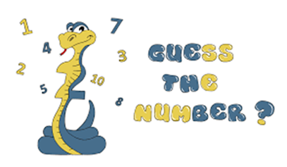

# GuessANumberByGaby-Vasil
 
This is simple console-base JavaScript game "Guess A Number" in which your opponent, "the computer" chooses a random number between "1 and 100" and your task is to guess this number.

You can try the console game trough here -> https://replit.com/@Vasil99/GuessANumber?v=1

Good luck! I hope you like it.